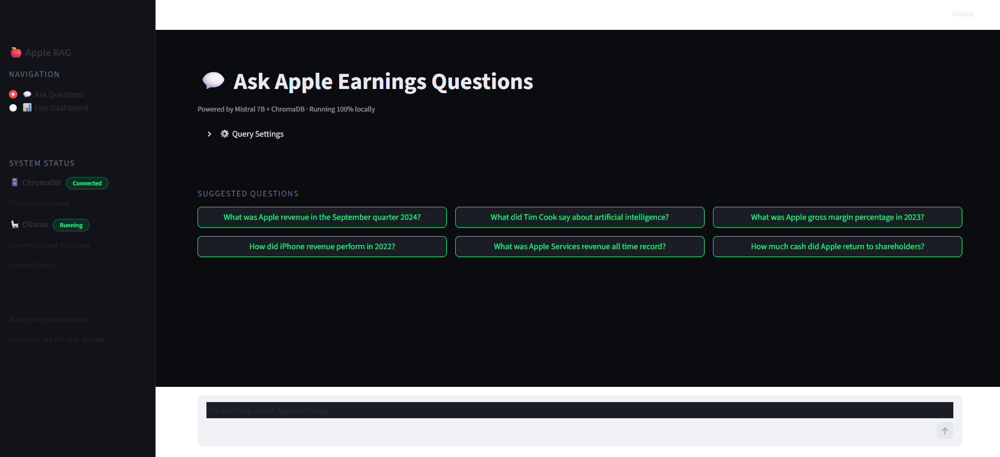
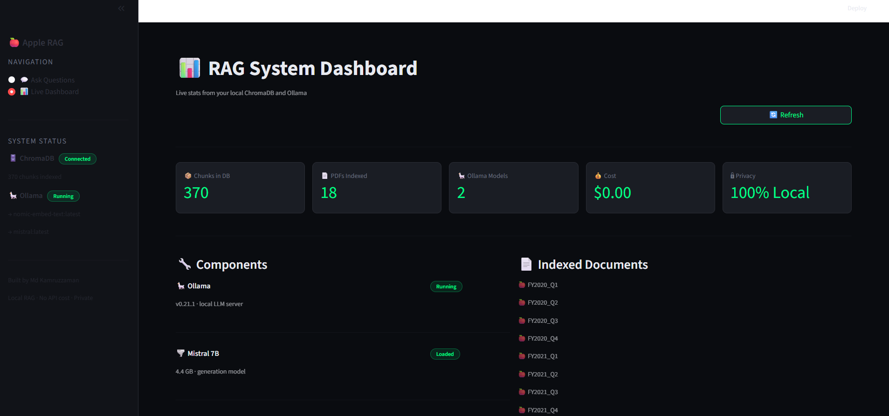
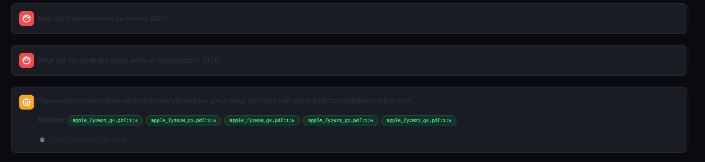

# 🍎 EarningsIQ — Apple Quarterly Earnings AI Assistant

> A fully local, private AI system that lets you ask natural language questions about Apple's quarterly earnings reports — powered by Mistral 7B, ChromaDB, LangChain, and a Streamlit web app. No API keys. No cloud. No cost. Everything runs on your machine.


---

## 📸 Screenshots

### 💬 Ask Questions — Chat Interface

*Natural language Q&A with source citations, suggested questions, and adjustable retrieval settings*

### 📊 Live System Dashboard

*Real-time stats: 370 chunks indexed, 18 PDFs, 2 Ollama models, $0.00 cost, 100% local*

### ✅ Successful RAG Answer with Sources

*Mistral correctly answers: "Apple posted $94.9 billion revenue, up 6% year over year" — with exact PDF source citations*

---

## 🎯 What This Project Does

EarningsIQ is a **Retrieval-Augmented Generation (RAG)** system built on Apple's official SEC quarterly earnings press releases spanning FY2020–FY2026. It answers financial questions grounded in real source documents — not AI guesswork.

**Example queries and answers:**

| Question | Answer | Source |
|----------|--------|--------|
| "Apple revenue September quarter 2024?" | $94.9 billion, up 6% YoY | apple_fy2024_q4.pdf |
| "Apple Services all-time revenue record?" | $30 billion (Q1 FY2026) | apple_fy2026_q1.pdf |
| "How much cash returned to shareholders 2024?" | Over $30 billion | apple_fy2025_q1.pdf |
| "iPhone revenue in 2022?" | $65.8B peak in Q1 FY2022 | apple_fy2022_q1.pdf |

---

## 🏗️ Architecture

```
┌─────────────────────────────────────────────────────────┐
│                    INDEXING PHASE                        │
│                  (run once per dataset)                  │
└─────────────────────────────────────────────────────────┘

  📄 Apple Earnings PDFs  →  ✂️ Chunker          →  🔢 nomic-embed-text
  17 quarters, SEC EDGAR     800 chars / 80 overlap   via Ollama
  FY2020 to FY2026                                        │
                                                          ▼
                                                    🗄️ ChromaDB
                                                    370 vectors
                                                    persisted locally

┌─────────────────────────────────────────────────────────┐
│                     QUERY PHASE                          │
│              (every time you ask a question)             │
└─────────────────────────────────────────────────────────┘

  ❓ Streamlit Chat  →  🔢 Same Embedder  →  🎯 Cosine Similarity
  (your question)       question → vector     top-k chunks from ChromaDB
                                                          │
                                                          ▼
                                              📋 Context Injection
                                              prompt + chunks + question
                                                          │
                                                          ▼
                                              🌪️ Mistral 7B (Ollama)
                                                          │
                                                          ▼
                                              ✅ Grounded Answer
                                              + PDF source citations
```

---

## 🛠️ Tech Stack

| Layer | Technology | Version | Purpose |
|-------|-----------|---------|---------|
| Web App | Streamlit | Latest | Browser-based chat + dashboard |
| LLM | Mistral 7B via Ollama | v0.21.1 | Answer generation |
| Embedding | nomic-embed-text via Ollama | Latest | Text → vector conversion |
| Vector DB | ChromaDB | 1.5.8 | Semantic similarity search |
| Orchestration | LangChain | 1.2.15 | RAG pipeline glue |
| PDF Loader | PyPDF | 6.10 | Document ingestion |
| Testing | Pytest + LLM-as-judge | Latest | AI-evaluated QA |
| Language | Python | 3.11.9 | Core runtime |
| Data Source | SEC EDGAR 8-K filings | FY2020–FY2026 | Apple earnings |

---

## 📊 Dataset — Apple Earnings (SEC EDGAR)

17 quarterly earnings press releases downloaded directly from SEC EDGAR (8-K Exhibit 99.1):

| Fiscal Year | Quarters | Revenue Range |
|-------------|----------|---------------|
| FY2020 | Q1, Q2, Q3, Q4 | $58.3B – $91.8B |
| FY2021 | Q1, Q2, Q3, Q4 | $81.4B – $111.4B |
| FY2022 | Q1, Q2, Q3, Q4 | $83.0B – $123.9B |
| FY2023 | Q1, Q2, Q3, Q4 | $81.8B – $117.2B |
| FY2024 | Q3, Q4 | $85.8B – $94.9B |
| FY2025 | Q3, Q4 | $94.0B – $102.5B |
| FY2026 | Q1 | $143.8B |

**370 total chunks** after processing. Chunk size: 800 chars. Overlap: 80 chars.

> **Apple fiscal year note:** Apple's fiscal year starts in October.
> FY2025 Q1 = Oct–Dec 2024. FY2024 Q4 = Jul–Sep 2024.

---

## 🚀 Getting Started

### Prerequisites

- Python 3.11.x ([download](https://www.python.org/downloads/release/python-3119/)) — **do not use Python 3.14**
- [Ollama](https://ollama.com/download) installed
- Git

### 1. Clone the Repository

```bash
git clone https://github.com/dipukamruzzaman/EarningsIQ.git
cd EarningsIQ
```

### 2. Pull Required Ollama Models

```bash
ollama pull mistral
ollama pull nomic-embed-text
```

Verify:
```bash
ollama list
# NAME                       SIZE
# nomic-embed-text:latest    274 MB
# mistral:latest             4.4 GB
```

### 3. Create Python Environment

```bash
python -m venv venv
venv\Scripts\activate          # Windows
# source venv/bin/activate     # Mac/Linux

pip install --upgrade pip
pip install langchain langchain-community langchain-chroma langchain-ollama pypdf chromadb pytest streamlit requests
```

### 4. Download Apple Earnings Data

```bash
python download_apple_earnings.py
```

Converts each downloaded `.htm` file to PDF:
1. Open in Chrome → `Ctrl+P` → **Save as PDF** → save to `data/` folder

### 5. Build the Vector Database

```bash
python populate_database.py
```

```
Number of existing documents in DB: 0
👉 Adding new documents: 370
```

### 6. Launch the Web App

```bash
streamlit run app.py
```

Opens at **http://localhost:8501** 🚀

---

## 💬 Using the Web App

### Page 1 — Ask Questions

- Type any question in the chat box at the bottom
- Click suggested question buttons for quick demos
- Adjust **k slider** in Query Settings for better trend answers
- Each answer shows green source chips + response time

**Query tips:**

| ✅ Works well | ❌ Works poorly |
|--------------|----------------|
| "Apple revenue September quarter 2024" | "What was Apple Q4 FY2024 revenue?" |
| "Apple Services all-time record" | "How did Services grow over the years?" |
| "What did Tim Cook say about Services?" | "Summarise all earnings reports" |
| Use k=10 for trend questions | Using k=5 for multi-year comparisons |

### Page 2 — Live Dashboard

- **370 chunks** live from ChromaDB
- All 17+ PDFs listed with fiscal year labels
- Component health: Ollama, Mistral, ChromaDB, LangChain
- ChromaDB Chunk Explorer — browse stored content per document
- Full pipeline flow diagram
- Python package versions

---

## ✅ QA Test Suite

```bash
python -m pytest test_rag.py -v
```

```
platform win32 -- Python 3.11.9

test_rag.py::test_monopoly_rules        PASSED  [ 50%]
test_rag.py::test_ticket_to_ride_rules  PASSED  [100%]

2 passed
```

### LLM-as-Judge Evaluation Pattern

The test suite uses Mistral to evaluate its own answers:

```python
EVAL_PROMPT = """
Expected Response: {expected_response}
Actual Response: {actual_response}
---
Does the actual response match? Answer 'true' or 'false'.
"""
```

This is the **LLM-as-judge** pattern — widely used in production RAG evaluation pipelines. The model compares its actual response against an expected answer and returns a boolean verdict.

---

## 🧪 QA Testing Findings

Systematic testing revealed four key findings:

### Finding 1 — Vocabulary Mismatch (High Impact)
Apple's press releases use calendar language ("September quarter 2024") not fiscal notation ("Q4 FY2024"). Queries using fiscal notation fail because embedding similarity scores drop below the retrieval threshold.

**Fix:** Always query using calendar language that matches the source documents.

### Finding 2 — Chunk Boundary Noise (Medium Impact)
Fixed-size chunking doesn't respect SEC filing structure. Some queries retrieved risk-factor boilerplate (page 1:2) instead of CEO quotes (page 0:1), because both pages contain similar financial vocabulary.

**Fix:** Document-structure-aware chunking that identifies and skips standard boilerplate sections.

### Finding 3 — Multi-Document Synthesis Limitation (Medium Impact)
Trend questions ("How did Services revenue grow over 5 years?") returned incomplete answers because RAG retrieves isolated chunks — not a full dataset view. Even k=10 chunks can't synthesise across 17 documents holistically.

**Fix:** Pre-extract key metrics per quarter into a structured table, queryable via a separate pipeline.

### Finding 4 — Retrieval Accuracy Confirmed (Positive Finding)
Source citations consistently pointed to correct PDF files and pages. `apple_fy2024_q4.pdf:0:0` was reliably retrieved for Q4 2024 revenue questions. The vector search layer is working correctly — failures are at query formulation and chunking layers only.

---

## 💡 Key Learnings

**Python version compatibility is critical.** Python 3.14 (released April 2025) broke numpy, chromadb, and most ML packages — no pre-built wheels available. Python 3.11.9 is the stable AI/ML choice.

**LangChain v1.x reorganised all imports.** Old paths like `langchain.vectorstores.chroma` and `langchain.llms.ollama` were moved to separate packages. Always use `langchain_chroma` and `langchain_ollama`.

**ChromaDB auto-persists now.** The `db.persist()` call was deprecated in newer versions. Calling it raises `AttributeError`. Remove it.

**Same embedding model everywhere.** The identical model must embed both documents and queries. Mixing models produces meaningless cosine similarity scores — retrieved chunks will be completely wrong.

**Query phrasing is a RAG engineering skill.** The gap between how users phrase questions and how documents are written is a core challenge. This project exposed it clearly through hands-on testing.

**LLM-as-judge scales QA.** Using the LLM to evaluate its own factual answers is fast, doesn't require human review for every test, and catches regressions automatically when you update the system.

---

## 📁 Project Structure

```
EarningsIQ/
├── data/                            # Apple earnings PDFs (17 quarters)
│   ├── apple_fy2020_q1.pdf
│   ├── apple_fy2020_q2.pdf
│   ├── ...
│   └── apple_fy2026_q1.pdf
├── chroma/                          # ChromaDB vector DB (auto-generated)
├── screenshots/                     # README screenshots
│   ├── query_page.png
│   ├── dashboard_page.png
│   └── rag_answer.png
├── app.py                           # ⭐ Streamlit web app (start here)
├── populate_database.py             # Chunk, embed, store documents
├── query_data.py                    # RAG query pipeline
├── get_embedding_function.py        # Embedding model config
├── test_rag.py                      # AI-evaluated test suite
├── inspect_rag.py                   # System health inspector
├── download_apple_earnings.py       # SEC EDGAR downloader
└── README.md
```

---

## 🔄 Resetting with New Documents

To swap in a different document set:

```bash
# Clear and repopulate
python populate_database.py --reset

# Verify new chunk count
python inspect_rag.py
```

---

## 🐛 Troubleshooting

| Error | Cause | Fix |
|-------|-------|-----|
| `ollama not recognized` | PATH not updated | Restart terminal or PC |
| `No module named langchain_chroma` | Wrong venv | Run `venv\Scripts\activate` |
| `numpy build error` | Python 3.14 | Use Python 3.11.x |
| `db.persist() AttributeError` | Deprecated in new ChromaDB | Remove the line |
| Empty answers | Vocabulary mismatch | Use calendar language in queries |
| 2–3 min response time | CPU-only inference | Normal without GPU |
| Wrong chunks retrieved | k too low | Increase k to 10 in Query Settings |

---

## 🔮 Future Improvements

- [ ] Structured metrics extraction for trend analysis
- [ ] Document-structure-aware chunking (skip boilerplate)
- [ ] Query rewriting to bridge fiscal/calendar notation
- [ ] Metadata filtering (query by fiscal year only)
- [ ] Multi-turn conversational memory
- [ ] Semantic chunking for better boundaries
- [ ] Apple-specific test cases in pytest suite
- [ ] Deploy to Streamlit Cloud for public demo
- [ ] Add comparison mode ("Q1 2024 vs Q1 2023")
- [ ] Support web scraping for automatic data updates

---

## 📬 Contact

**Md Kamruzzaman** — QA Engineer & AI Automation Enthusiast

- 📧 [dipukamruzzaman1@gmail.com](mailto:dipukamruzzaman1@gmail.com)
- 💼 [linkedin.com/in/md-kamruzzaman-sqa](https://www.linkedin.com/in/md-kamruzzaman-sqa)
- 🐙 [github.com/dipukamruzzaman](https://github.com/dipukamruzzaman)
- 🌐 [mk-qa-engineer.netlify.app](https://mk-qa-engineer.netlify.app/)

---

## 🙏 Acknowledgements

- [pixegami/rag-tutorial-v2](https://github.com/pixegami/rag-tutorial-v2) — original RAG project foundation
- [Ollama](https://ollama.com) — local LLM serving
- [LangChain](https://langchain.com) — RAG orchestration framework
- [ChromaDB](https://trychroma.com) — vector database
- [Mistral AI](https://mistral.ai) — open-weight language model
- [SEC EDGAR](https://www.sec.gov) — Apple earnings data source
- [Streamlit](https://streamlit.io) — web app framework

---

## 📄 License

MIT License — free to use, modify, and share.

---

*Built as part of a 4-month AI Automation Engineer learning journey by a QA professional. Every dependency conflict, Python version issue, and import error documented above was encountered and solved during a single build session — making this a realistic reference for anyone building local RAG systems on Windows.*

*Total build time: 1 day · Total API cost: $0.00 · Data privacy compromised: 0%*
