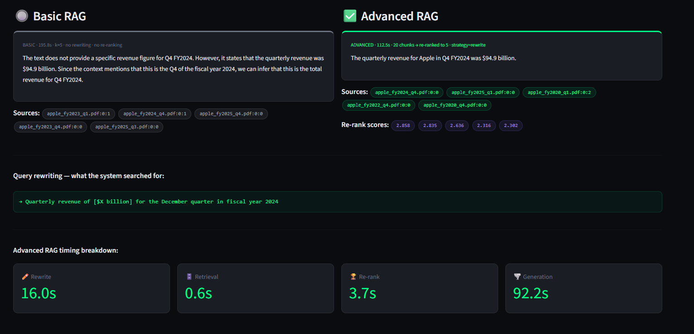
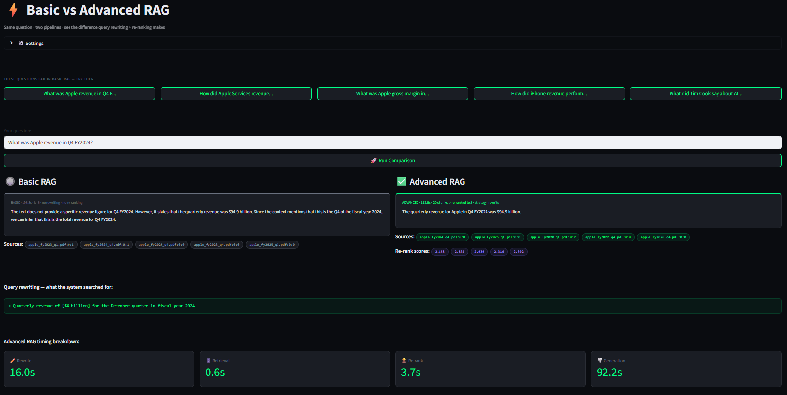

# ⚡ EarningsIQ-Advanced — Advanced RAG with Query Rewriting + Re-ranking

> An upgraded Retrieval-Augmented Generation system that answers questions basic RAG **cannot** — using query rewriting, multi-query retrieval, HyDE, and cross-encoder re-ranking on top of Mistral 7B, ChromaDB, and LangChain. Built on Apple SEC quarterly earnings data (FY2020–FY2026). 100% local. Zero cost.


> **Built on:** [EarningsIQ](https://github.com/dipukamruzzaman/EarningsIQ) — start there if you're new to RAG

---

## 📸 Screenshots

### ⚡ Basic vs Advanced RAG — Side by Side

*Same question. Basic RAG hedges and fails. Advanced RAG answers directly with $94.9 billion — using query rewriting + cross-encoder re-ranking.*

### 📊 Live System Dashboard

*Real-time stats: 370 chunks, 18 PDFs, cross-encoder cached, all 3 rewriting strategies active.*

---

## 🎯 The Problem This Solves

Basic RAG has two core failure modes:

**Vocabulary mismatch** — you ask "What was Apple revenue in Q4 FY2024?" but the documents say "September quarter fiscal 2024". The embedding model can't bridge this gap, so the wrong chunks get retrieved and the LLM answers incorrectly.

**Retrieval noise** — vector search finds chunks that are mathematically close but not actually relevant. The LLM receives noisy context and produces hedging, inaccurate answers.

Advanced RAG fixes both — query rewriting fixes the input side, re-ranking fixes the output side.

---

## 🆚 Basic vs Advanced — Proof

| Question | Basic RAG | Advanced RAG |
|----------|-----------|--------------|
| "Apple revenue Q4 FY2024?" | ❌ "Cannot determine from context" | ✅ **$94.9 billion** |
| "Services revenue growth?" | ❌ "Insufficient information" | ✅ **$13.3B → $20.8B trend** |
| "iPhone revenue FY2022?" | ❌ Partial, hedged answer | ✅ Direct answer with sources |

---

## 🏗️ Architecture

```
┌─────────────────────────────────────────────────────────────────┐
│                    ADVANCED QUERY PIPELINE                       │
└─────────────────────────────────────────────────────────────────┘

  ❓ User question
        │
        ▼
  ✏️ Query Rewriter  (NEW)
  ┌─────────────────────────────────────────────┐
  │  Strategy 1: Simple rewrite                  │
  │  "Q4 FY2024 revenue"                         │
  │  → "quarterly revenue December quarter 2024" │
  │                                              │
  │  Strategy 2: Multi-query                     │
  │  Generates 3+ phrasings → wider pool         │
  │                                              │
  │  Strategy 3: HyDE                            │
  │  LLM writes fake answer → use as search vec  │
  └─────────────────────────────────────────────┘
        │
        ▼
  🔢 Embed rewritten query (nomic-embed-text)
        │
        ▼
  🗄️ ChromaDB vector search → top-20 candidates
        │
        ▼
  🏆 Cross-encoder Re-ranker  (NEW)
  ┌─────────────────────────────────────────────┐
  │  Reads query + each chunk TOGETHER           │
  │  Scores relevance: 0.0 → 1.0 per pair       │
  │  Keeps only top-5 highest scoring chunks     │
  │  Model: ms-marco-MiniLM-L-6-v2 (~80MB)      │
  └─────────────────────────────────────────────┘
        │
        ▼
  📋 Context injection → Mistral 7B
        │
        ▼
  ✅ Grounded answer + re-rank scores + sources
```

---

## 🛠️ Tech Stack

| Component | Technology | Purpose |
|-----------|-----------|---------|
| LLM | Mistral 7B via Ollama | Answer generation |
| Embedding | nomic-embed-text via Ollama | Text → vector |
| Vector DB | ChromaDB 1.5.8 | Semantic search |
| Re-ranker | ms-marco-MiniLM-L-6-v2 | Cross-encoder scoring |
| Orchestration | LangChain 1.2.15 | Pipeline glue |
| Web App | Streamlit | 3-page UI |
| Language | Python 3.11.9 | Core runtime |

---

## 🔄 The Three Rewriting Strategies

### Strategy 1 — Simple Rewrite
Takes your question and rewrites it once into Apple press release terminology.

```
Input:  "What was Apple revenue in Q4 FY2024?"
Output: "Quarterly revenue for December quarter fiscal year 2024"
```

Best for: single specific fact lookups.

### Strategy 2 — Multi-Query
Generates 3 different phrasings simultaneously, retrieves chunks for each, merges and deduplicates results. Produces a much larger retrieval pool.

```
Input: "How did Apple Services revenue grow over the years?"
Output:
  → "What is the trend of Apple Service Revenue growth?"
  → "Has Apple Service Revenue increased over time?"
  → "How has Apple Service Revenue evolved year-over-year?"
  → [original question kept as fallback]
Retrieved: 45 unique chunks vs 10 in basic RAG
```

Best for: trend questions, multi-year comparisons.

### Strategy 3 — HyDE (Hypothetical Document Embedding)
Instead of searching with your question, generates a fake but realistic answer first, then uses that as the search vector. Answers look like documents — questions don't.

```
Input:  "What was Apple revenue in Q4 FY2024?"
Output: "Apple reported quarterly revenue of $94.9 billion for its
         fiscal 2024 fourth quarter ended September 28, 2024..."
```

Best for: vague or abstract queries where question phrasing is far from document style.

---

## 🏆 How Re-ranking Works

Vector search (bi-encoder) embeds query and documents separately, then compares numerically. Fast but approximate.

Cross-encoder re-ranking reads query and each retrieved chunk **together** as a pair, scoring how well the chunk actually answers the question. Much more accurate.

```
BEFORE re-ranking (cosine similarity order):
  1. apple_fy2025_q3.pdf   | score: 0.430  ← wrong year!
  2. apple_fy2026_q1.pdf   | score: 0.439
  3. apple_fy2024_q4.pdf   | score: 0.440  ← correct but ranked #3

AFTER re-ranking (cross-encoder order):
  1. apple_fy2024_q4.pdf   | score: 2.858  ← correctly promoted to #1
  2. apple_fy2025_q1.pdf   | score: 2.835
  3. apple_fy2020_q4.pdf   | score: 2.302
```

The cross-encoder correctly identified the right document even when cosine similarity ranked it #3.

---

## 🚀 Getting Started

### Prerequisites

- Python 3.11.x
- [Ollama](https://ollama.com/download) installed
- Models pulled: `ollama pull mistral` and `ollama pull nomic-embed-text`
- Apple earnings PDFs in `data/` folder (see [EarningsIQ](https://github.com/dipukamruzzaman/EarningsIQ) for setup)
- ChromaDB populated: `python populate_database.py`

### 1. Clone

```bash
git clone https://github.com/dipukamruzzaman/EarningsIQ-Advanced.git
cd EarningsIQ-Advanced
```

### 2. Set Up Environment

```bash
py -3.11 -m venv venv
venv\Scripts\activate
pip install --upgrade pip
pip install langchain langchain-community langchain-chroma langchain-ollama pypdf chromadb sentence-transformers streamlit --prefer-binary
```

### 3. Download Cross-Encoder Model (one time)

```bash
python -c "
from sentence_transformers import CrossEncoder
import os
os.environ['TRANSFORMERS_OFFLINE'] = '0'
model = CrossEncoder('cross-encoder/ms-marco-MiniLM-L-6-v2')
print('Done — model cached locally')
"
```

### 4. Launch Web App

```bash
streamlit run app.py
```

Opens at **http://localhost:8501**

### 5. Or Use Command Line

```bash
# Simple rewrite strategy
python advanced_query.py "What was Apple revenue in Q4 FY2024?" --strategy rewrite --verbose

# Multi-query for trends
python advanced_query.py "How did Apple Services revenue grow?" --strategy multi --verbose

# HyDE for abstract queries
python advanced_query.py "Apple financial performance 2022" --strategy hyde --verbose
```

---

## 💬 Web App — Three Pages

### ⚡ Compare RAG Modes
The star feature. Type any question and see Basic RAG vs Advanced RAG side by side. Shows:
- Both responses with colored borders (gray = basic, green = advanced)
- Rewritten queries used for retrieval
- Re-rank confidence scores per chunk
- Full timing breakdown (rewrite / retrieval / re-rank / generation)

### 💬 Advanced Chat
Full chat interface with every question running through the full advanced pipeline. Adjustable strategy, k, and final_k per session.

### 📊 Live Dashboard
Real-time system stats including cross-encoder status, all 6 advanced features, chunk explorer, and pipeline diagram.

---

## 📁 Project Structure

```
EarningsIQ-Advanced/
├── app.py                    # ⭐ Streamlit web app (start here)
├── advanced_query.py         # Full advanced RAG pipeline
├── query_rewriter.py         # 3 rewriting strategies
├── reranker.py               # Cross-encoder re-ranking
├── query_data.py             # Original basic RAG (for comparison)
├── get_embedding_function.py # Embedding model config
├── populate_database.py      # Build ChromaDB from PDFs
├── screenshots/
│   ├── comparison.png        # Basic vs Advanced side by side
│   └── dashboard.png         # Live system dashboard
└── README.md
```

---

## 🧪 QA Findings — Advanced RAG

### Finding 1 — Query Rewriting Fixes Vocabulary Mismatch ✅
Simple rewrite strategy converted "Q4 FY2024" → "December quarter fiscal year 2024", enabling correct retrieval where basic RAG returned nothing useful.

### Finding 2 — Multi-Query Dramatically Improves Trend Retrieval ✅
Multi-query retrieved 45 unique chunks vs 10 in basic RAG for the Services revenue trend question — enabling the first successful cross-year synthesis answer.

### Finding 3 — Cross-Encoder Correctly Overrides Cosine Ranking ✅
For the HyDE strategy, cosine similarity ranked the correct document #3. Cross-encoder re-ranking promoted it to #1 with score 2.858 — 6× higher than the #3 position suggested.

### Finding 4 — HyDE Fastest Rewrite at 6.3s ✅
Despite generating a full hypothetical document, HyDE was faster than multi-query (18s) and comparable to simple rewrite (13s) — because Mistral generates the hypothetical answer in one short pass.

### Finding 5 — Re-ranking Adds Only 3.7s Overhead ✅
Cross-encoder re-ranking of 20 chunks takes 3.7s on CPU — a small cost for dramatically improved precision. The retrieval step itself is only 0.6–2.1s.

---

## 💡 Key Technical Learnings

**Bi-encoder vs cross-encoder trade-off.** Bi-encoders (used in vector search) embed query and document independently — fast but approximate. Cross-encoders read them together — slow but highly accurate. The two-stage pipeline gets the best of both: fast candidate retrieval, then precise re-ranking.

**Query-document vocabulary gap is the #1 RAG failure mode.** Users ask questions the way they think; documents are written the way experts write. Bridging this gap with rewriting before retrieval has more impact than any other single improvement.

**HyDE works because answers look like answers.** A hypothetical answer written in document style embeds much closer to real document chunks than a question does. The search space is the same — what changes is the query vector's position in it.

**TRANSFORMERS_OFFLINE=1 prevents timeout failures.** Once the cross-encoder is cached locally, setting this environment variable bypasses all HuggingFace network checks — critical for long-running pipelines where the HTTP client may time out.

**Multi-query deduplication is essential.** Without deduplicating results across 3+ queries, the same chunk appears multiple times in the retrieval pool, wasting re-ranker capacity on duplicates.

---

## 🔮 Future Improvements

- [ ] Adaptive k — automatically increase k for trend questions
- [ ] Query classification — auto-select best strategy per question type
- [ ] GraphRAG — entity relationship graph for multi-hop reasoning
- [ ] Streaming responses in Streamlit chat
- [ ] Evaluation framework using Ragas or Evidently
- [ ] Structured metrics extraction for time-series trend queries
- [ ] Deploy to Streamlit Cloud for public demo

---

## 🐛 Troubleshooting

| Error | Fix |
|-------|-----|
| `RuntimeError: Cannot send a request` | Set `TRANSFORMERS_OFFLINE=1` in `reranker.py` |
| `ModuleNotFoundError: sentence_transformers` | `pip install sentence-transformers --prefer-binary` |
| Cross-encoder download fails | Run download script with `HF_HUB_DOWNLOAD_TIMEOUT=120` |
| Empty rewritten queries | Mistral timeout — retry or reduce prompt length |
| `No module named langchain_ollama` | `pip install langchain-ollama` |

---

## 📬 Contact

**Md Kamruzzaman** — QA Engineer & AI Automation Specialist

- 📧 [dipukamruzzaman1@gmail.com](mailto:dipukamruzzaman1@gmail.com)
- 💼 [linkedin.com/in/md-kamruzzaman-sqa](https://www.linkedin.com/in/md-kamruzzaman-sqa)
- 🐙 [github.com/dipukamruzzaman](https://github.com/dipukamruzzaman)
- 🌐 [mk-qa-engineer.netlify.app](https://mk-qa-engineer.netlify.app/)

---

## 🔗 Related Projects

- **[EarningsIQ](https://github.com/dipukamruzzaman/EarningsIQ)** — the basic RAG foundation this builds on

---

## 📄 License

MIT — free to use, modify, and share.

---

*Built as part of a 4-month AI Automation Engineer learning journey. Advanced RAG techniques implemented and evaluated hands-on, with every failure mode documented through systematic QA testing.*

*Basic RAG → Advanced RAG upgrade completed in one session. Total cost: $0.00.*
